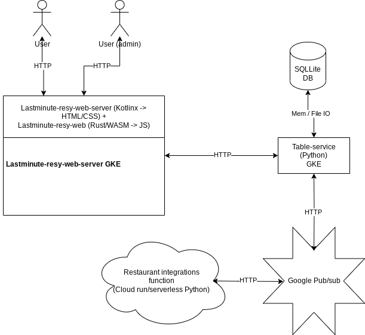
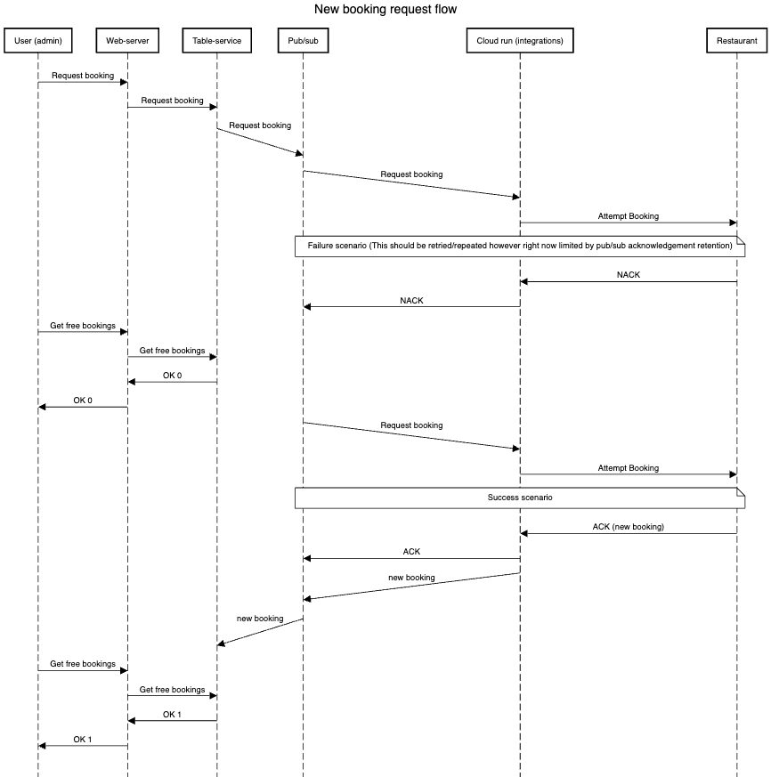

<h1>Lastminuteresy-web-server</h1>

Web server for lastminute-resy website content.
Currently deployed to <a>http://35.233.70.88:8080</a> with possibility to request new booking at <a>http://35.233.70.88:8080/admin/book</a>

Build docker image: ./gradlew buildImage
Run locally:
./gradlew buildImage
./gradlew publishImageToLocalRegistry
docker run -p 8080:8080 <image_name>

Also serves demo restaurant booking page at 
<a>http://35.233.70.88:8080/demorestaurant/bookTable.html</a>

<h2>Deploy process</h2>

prerequisties: docker image for linux/arm64 (see above or use Dockerfile) and gcloud / credentials configured

<ul>
<li>push artifact (image)  
docker push europe-west1-docker.pkg.dev/${PROJECT_ID}/lastminuteresy/web:tag</li>
<li>(optional) credentials for cluster 
gcloud container clusters get-credentials hello-cluster --region europe-west1</li>
<li><strong>create deployment for new image</strong> 
kubectl create deployment lastminuteresy-web --image=europe-west1-docker.pkg.dev/${PROJECT_ID}/lastminuteresy/web:tag</li>
 alternative rolling update only  
kubectl set image deployment/lastminuteresy-web web=europe-west1-docker.pkg.dev/${PROJECT_ID}/lastminuteresy/web:new-tag
<li>set replicas (if needed) 
kubectl scale deployment lastminuteresy-web --replicas=3
 autoscaling (optional) 
kubectl autoscale deployment lastminuteresy-web --cpu-percent=80 --min=1 --max=5
<li>???</li>
<li>Profit</li>
</ul>

<h1>System architecture and new booking request flow sequence diagram</h1>
 

(should be moved elsewhere but for the time being here)

 
<h2>Architecture</h2>

<h2>New booking request flow</h2>

